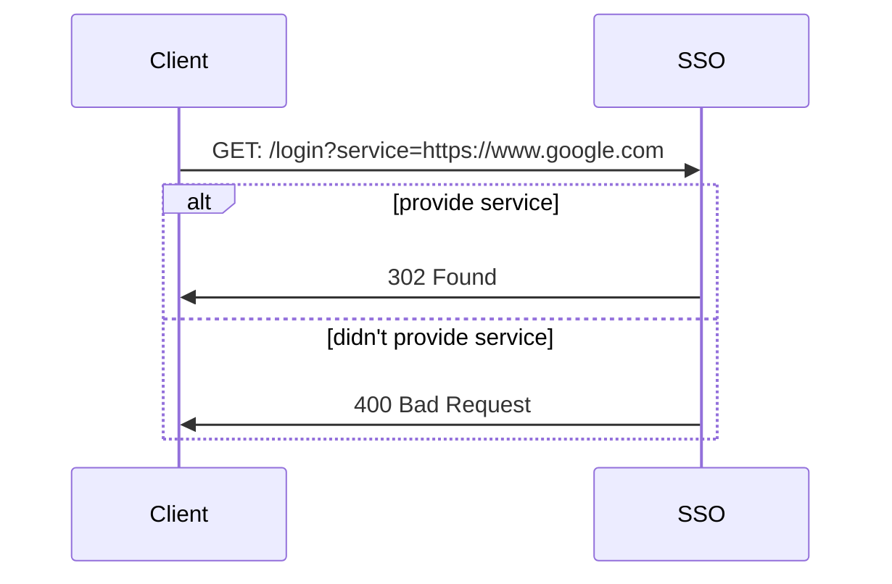

## Chula SSO

A standalone chula-sso-mock based on [chula-sso](https://account.it.chula.ac.th/wiki/doku.php?id=how_does_it_work)

Being used in development by [Piyaphat Pinyo](https://www.github.com/remove158)

Please feel free to use [https://sso.piyaphat.com](https://sso.piyaphat.com/login?service=https://www.google.com)

## Usage

Docker images are available on the [GitHub Packages](https://github.com/remove158/chula-sso/pkgs/container/chula-sso).

1. Install docker
2. Download the image: `docker pull ghcr.io/remove158/chula-sso:latest`
3. Run: `docker run -p 8080:8080 ghcr.io/remove158/chula-sso:latest`

## Preview


## Configuration

The configuration is done by the following environment variables. (see [`docker run`](https://docs.docker.com/engine/reference/commandline/run/#set-environment-variables--e---env---env-file) on how to set it)

| Name         | Environment Variable | Default |
| ------------ | -------------------- | ------- |
| DeeAppId     | DEE_APP_ID           | test    |
| DeeAppSecret | DEE_APP_SECRET       | test    |
| Port         | PORT                 | 8080    |

## Endpoint

### GET /login

-   Request

```sh
curl --request GET \
  --url 'https://sso.piyaphat.com/login?service=https://www.google.com'
```

-   Response 302 Found

```js
// (on-success) 302 Location: https://www.google.com?ticket=86966dc5-2049-428f-88fe-2d78a5985d38
```

-   Response 400 Bad Request

```json
{
    "error": "Key: 'GetLoginRequest.Service' Error:Field validation for 'Service' failed on the 'required' tag"
}
```

### GET, POST /serviceValidation

-   Request

```sh
curl --request POST \
  --url 'https://sso.piyaphat.com/serviceValidation' \
  --header 'DeeAppId: test' \
  --header 'DeeAppSecret: test' \
  --header 'DeeTicket: 1b50cf0d-ceed-46da-a672-4c61060ece8d'
```

-   Response 200 (application/json)

```json
{
    "uid": "14c6c69f-21ca-4999-999c-423dde2515ad",
    "username": "6200000021",
    "gecos": "Prayut Chan-Angkhan, ENG",
    "disable": false,
    "roles": ["student"],
    "firstname": "Prayut",
    "firstnameth": "Prayut",
    "lastname": "Chan-Angkhan",
    "lastnameth": "Chan-Angkhan",
    "ouid": "6200000021",
    "email": "6200000021@student.chula.ac.th"
}
```

-   Response 401 Unauthorized

```json
{
    "error": "ticket not found"
}
```

## Diagram

### Login


