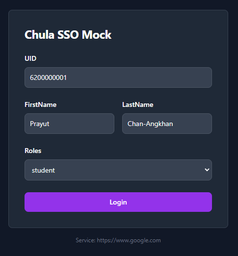

## Chula SSO
A standalone chula sso based on [chula-sso](https://account.it.chula.ac.th/wiki/doku.php?id=how_does_it_work)

Being used in development by [Piyaphat Pinyo](https://www.github.com/remove158)

## Usage

Docker image is available at [Docker](https://hub.docker.com/r/pay2630/chulassomock)

1. Install docker
2. Download the image: `docker pull ghcr.io/remove158/chula-sso:latest`
3. Run: `docker run -p 8080:8080 ghcr.io/remove158/chula-sso:latest`

## Preview


## Configuration

The configuration is done by the following environment variables. (see [`docker run`](https://docs.docker.com/engine/reference/commandline/run/#set-environment-variables--e---env---env-file) on how to set it)

| Name  | Environment Variable | Default |
|-------|----------------------|---------|
| DeeAppId | DEE_APP_SECRET             | test   |
| DeeAppSecret | DEE_APP_ID     | test |
|Port   | PORT                 | 8080    |

## Endpoint
- GET: /login?service={your-service-here}
```
GET: /login?service=https://www.google.com

Response: 
(on-success) 301 Redirect to https://www.google.com?ticket=86966dc5-2049-428f-88fe-2d78a5985d38
```
- GET,POST: /serviceValidation

```
GET,POST : /serviceValidation

Header : {
	DeeAppId : string, 
	DeeAppSecret: string, 
	DeeTicket: string
}

Response: 
(on-success) 200
{ 
	"uid": "string",
	"username": "string",
	"gecos": "string",
	"disable":  false,
	"roles": ["student"],
	"firstname": "string",
	"firstnameth": "string",
	"lastname": "string",
	"lastnameth": "string",
	"ouid": "string",
	"email": "string"
}

(on-fail) 401

```